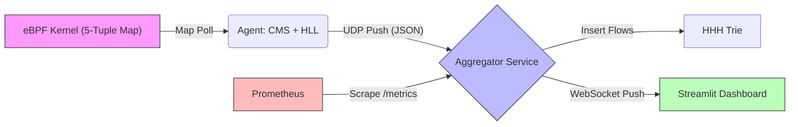

# Traffic Monitor Agent (TMA)


**TMA** is a high-performance **eBPF-based Network Telemetry System** designed for next-generation data centers. It delivers line-rate visibility with **near-zero overhead**, replacing legacy capture tools with modern, kernel-native observability.

---

## 📋 Table of Contents
- [The Challenge](#-the-challenge)
- [Key Features](#-key-features)
- [Installation & Usage](#-installation--usage)
- [Architecture](#-architecture)
- [Data Flow](#-data-flow-push-model)
- [Project Structure](#-project-structure)
- [Troubleshooting](#-troubleshooting)

---

## 💡 The Challenge
Legacy monitoring tools (like `tcpdump` or `Wireshark`) rely on **user-space packet capture**, which requires copying every packet from the kernel. 
*   **The Problem:** At high speeds (10Gbps+), this copying saturates the CPU, causing **packet loss (>50%)** and **observer effect** (slowing down the app).
*   **The Solution:** TMA uses **eBPF (Extended Berkeley Packet Filter)** to analyze traffic **inside the kernel** (Zero-Copy). It aggregates stats into compact "Sketches" (CMS/HLL) and sends only lightweight telemetry metadata to user space.

---

## 🚀 Key Features

*   **Omni-Directional eBPF:** Automatically attaches hooks to **ALL** ethernet interfaces (`eth+`) to capture 100% of traffic.
*   **5-Tuple High Fidelity:** Full flow correlation: `Source IP`, `Dest IP`, `Source Port`, `Dest Port`, `Protocol`.
*   **Probabilistic Analytics (Sketches):**
    *   **Count-Min Sketch (CMS):** Tracks "Heavy Hitters" with constant memory (O(1)).
    *   **HyperLogLog (HLL):** Estimates massive cardinality (Unique Flows) with >99% accuracy.
*   **Real-Time Push Architecture:** Sub-second latency via `UDP -> WebSocket -> Streamlit`.
*   **Hierarchical Visualization:** Interactive **Network Icicle Plot** for bandwidth analysis.

---

## 🛠️ Installation & Usage

### Prerequisites
*   **Docker Desktop** (Linux/Mac/Windows)
*   **Privileged Mode:** Must be enabled for container runtime.

### Quick Start
1.  **Start the Stack:**
    ```bash
    docker-compose up --build -d
    ```

2.  **Access Dashboard:**
    *   Navigate to **[http://localhost:8501](http://localhost:8501)**.
    *   **Normal Mode:** Observes background traffic.
    *   **Heavy Traffic Mode:** Click "🌊 HEAVY TRAFFIC" to trigger flow generation.

3.  **View Telemetry:**
    *   **Live Metrics:** Top flows & HLL Cardinality.
    *   **Network Hierarchy:** Interactive Icicle Plot.
    *   **Grafana (Optional):** [http://localhost:3000](http://localhost:3000) (admin/admin).

---

## 🏗️ Architecture

The system models a segmented data center network orchestrated via Docker Compose:

### 1. Network Topology
*   **Zone A (172.25.10.x):**
    *   **Host-A**: Gateway / Attacker Node.
    *   **Host-B**: Internal Service Node.
*   **Zone B (172.25.20.x):**
    *   **Host-C, Host-D**: Target Nodes.

### 2. Components
*   **Agent Container (`/agent`)**:
    *   **eBPF Kernel:** `traffic.bpf.c` (TC Ingress/Egress Hooks).
    *   **Agent 2.0:** Python userspace collector (Polls Map -> Updates Sketches -> Exports JSON).
*   **Aggregator (`/aggregator`)**:
    *   **Ingest Service:** Receives UDP JSON payloads.
    *   **HHH Trie:** Aggregates heavy hitters into a Prefix Trie.
    *   **Broadcaster:** Manages WebSocket connections.
*   **Visualization (`/dashboard`)**:
    *   **Streamlit UI:** Renders live charts and tables.

---

## 🌊 Data Flow (Push Model)



### 1. eBPF Capture (Kernel Space)
*   **Mechanism**: `traffic.bpf.c` intercepts packets at `TC_INGRESS/EGRESS`.
*   **Data Structure (Map Key)**:
    ```c
    struct flow_key {
        u32 src_ip;
        u32 dst_ip;
        u16 src_port;
        u16 dst_port;
        u8  proto;
        u8  pad[3];
    };
    ```

### 2. Agent Analytics (User Space)
*   **Mechanism**: `agent.py` polls map, computes deltas, and feeds Sketches.
*   **Export Format (UDP Payload)**:
    ```json
    {
      "timestamp": "ISO8601",
      "agent_cpu": 5.2,
      "cms": { "heavy_hitters_bytes": [...] },
      "hll": { "summary": { "cardinalities": {...} } }
    }
    ```

### 3. Aggregator & Visualization (WebSockets)
*   **Mechanism**: Aggregator inserts flows into **HHH Trie** and broadcasts to Dashboard.
*   **Dashboard Input**: `{"heavy_hitters": [{"prefix": "10.0.0.1", "value": 800}], ...}`

### 4. Storage & History (Pull Model)
*   **Mechanism**: Prometheus scrapes Aggregator every 15s.
*   **Endpoint**: `http://aggregator:8080/metrics` (OpenMetrics Format).
*   **Storage**: Prometheus TSDB.

---

## 📂 Project Structure

```bash
.
├── agent/              # eBPF C code, Python Agent (CMS/HLL), Controller
├── aggregator/         # Central Collector (Ingest -> Trie -> WebSocket)
├── benchmark/          # Performance Tests (eBPF vs Legacy) & Reports
├── dashboard/          # Streamlit UI (Visualizes CMS/HLL/Trie)
├── docker-compose.yml  # Network Topology
└── storage/            # Prometheus/Grafana configs
```